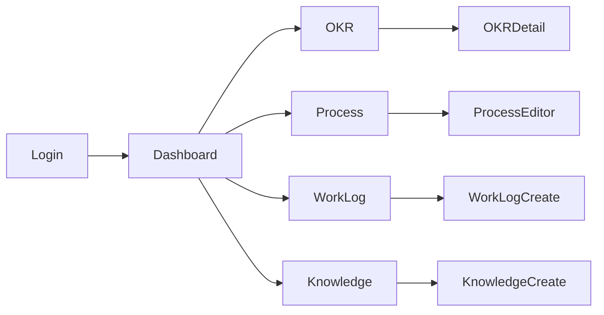

# IA / 화면 설계(초안)

## 전역
- 상단 네비게이션: 대시보드, OKR, 프로세스, 업무일지, 노하우, 리포트, 설정
- 사이드바(페이지별): 필터/태그/기간

## 페이지
- 대시보드: 내 OKR 진행률, 최근 체크인, 최근 일지, 알림/리스크 카드
- OKR
  - 목록/필터(기간/상태/팀)
  - 상세: Objective 요약, KR 카드(진행률/신뢰도), 체크인 히스토리, Initiative 리스트
- 프로세스
  - 에디터: React Flow 기반 노드/엣지 드래그, 속성 패널, 버전 저장/게시
  - 보기: 활성 버전 읽기 전용, 노드 검색/하이라이트
- 업무일지
  - 일/주간 탭, 템플릿(어제/오늘/리스크/도움필요)
  - 로그와 OKR/KR/프로세스 노드 링크, 멘션/첨부
- 노하우
  - 에디터(Markdown/리치 텍스트), 태그, 미리보기
  - 검색/필터, 즐겨찾기
- 리포트
  - OKR 추세, 체크인 히트맵, 리스크 요약
- 설정
  - 프로필, 팀, 권한, 통합(SSO/OAuth), 데이터 백업

## 내비게이션 흐름(예시)

